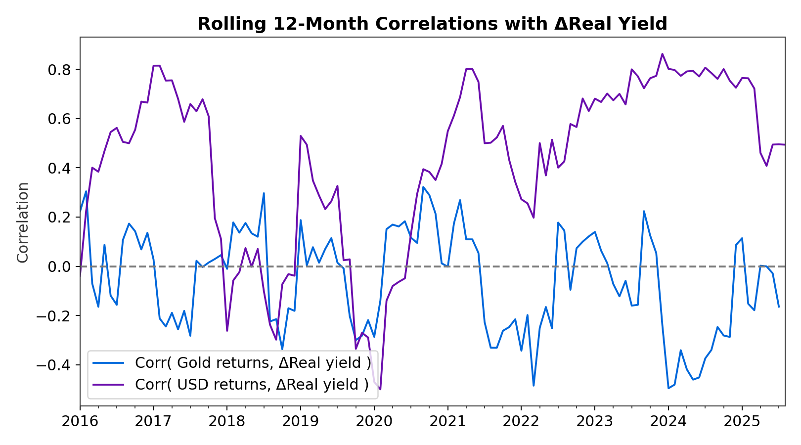
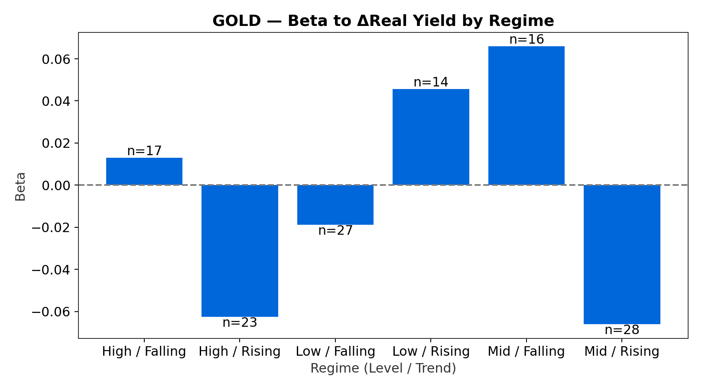
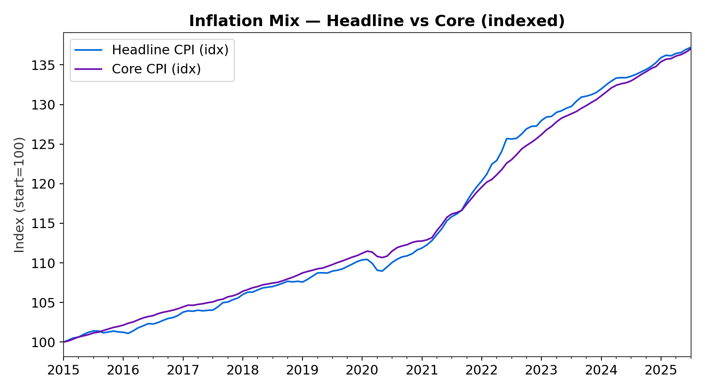
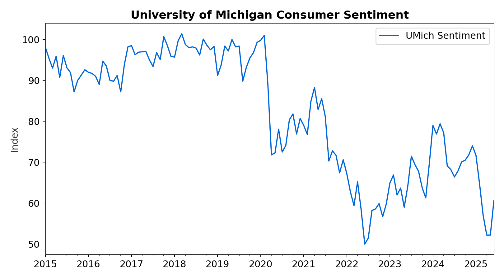

# When Real Yields Rise but Gold Doesn't Blink\n\n**A decoupling worth your attention—and a simple regime map to trade it.**\n*August 17, 2025*\n\nHigher real yields usually pressure gold and support the dollar. Not this time. Gold's resilience and a softer USD beta point to a regime shift. Below is the evidence, followed by a quick macro dashboard.\n\n## Deep Dive\n\n### Real Yields vs. Gold (indexed)\n\n*Higher real yields typically weigh on gold. Lately, gold hasn't flinched—the decoupling looks like a regime.*\n\n### Real Yields vs. Trade-Weighted USD (indexed)\n\n*The dollar's beta to real yields looks softer than prior cycles. If that persists, the playbook changes.*\n\n### 12-Month Excess: Gold – USD\n\n*Gold's relative carry to the dollar is positive on a 12-month lookback—more than just a hedge.*\n\n### Rolling 12-Month Correlations with ΔReal Yield\n\n*Correlations aren't constants; they're regimes. The gold–real yield link has weakened while USD–real yield remains directionally intact.*\n\n### Regime Betas: Asset returns vs ΔReal Yield (by level/trend)\n\n*Gold's sensitivity is most negative when real yields are high & rising; USD shows the mirror image.*\n\n\n\n## Macro Dashboard\n\n### U.S. Nonfarm Payrolls\n\n*Still expanding, but the slope is cooling—late-cycle tells.*\n\n### Unemployment Rate\n\n*Edging up from the floor—small moves matter at this stage.*\n\n### Inflation Mix — Headline vs Core (indexed)\n\n*Core remains sticky; services carry the load.*\n\n### Conference Board LEI\n\n*Still flagging slower growth; duration of weakness matters.*\n\n### University of Michigan Consumer Sentiment\n\n*Households feel the pinch; expectations wobble more than conditions.*\n\n## What Would Change My Mind?\n\n- **Invalidate decoupling:** a sharp USD rally **and** gold drawdown on the same real-yield impulse.\n- **Confirm decoupling:** gold holds firm despite further grind higher in real yields.\n\n## Watchlist\n\n- Real yield trend and level (DFII10 tertiles).\n- USD beta drift versus Δreal yields.\n- Central bank gold purchases (flow support vs. cycle).\n\n*Tables:* `tables/regime_betas_vs_dRealYield.csv`