# LIGHTHOUSE MACRO: THE HORIZON — 2026 OUTLOOK
## THE LIQUIDITY TWILIGHT ZONE

**To:** Lighthouse Macro Clients & Partners
**From:** Bob Sheehan, CFA, CMT
**Date:** December 19, 2025
**Re:** Year-End Macro Framework & Positioning

---

# SYSTEM STATUS | LIVE INDICATORS

```
══════════════════════════════════════════════════════════════
              LIGHTHOUSE MACRO | SYSTEM STATUS
                    December 18, 2025
══════════════════════════════════════════════════════════════

>>> MACRO RISK INDEX (MRI):     +0.05
>>> REGIME:                     ELEVATED RISK

─── COMPONENT BREAKDOWN (Z-Scores) ───────────────────────────

Labor Fragility (LFI):          +0.18   (High = Stress)
Labor Dynamism (LDI):           -1.38   (Low = Weak)
Liquidity Cushion (LCI):        -0.98   (Low = Stress)
Yield/Funding Stress (YFS):     -1.75
Equity Momentum (EMD):          -0.20
Credit Stress (HY OAS z):       -0.28

─── CREDIT-LABOR GAP (CLG) ───────────────────────────────────

CLG: -0.45   Spreads nearly aligned with labor weakness

─── RAW INPUTS ───────────────────────────────────────────────

Quits Rate:             1.8%
Hires/Quits Ratio:      1.78
LT Unemployment Share:  24.3%
ON RRP/GDP:             0.04%
Reserves/GDP:           9.71%
HY OAS:                 299 bps
10Y-3M Curve:           +0.52%
SOFR-EFFR Spread:       +2.0 bps
S&P 500:                6,775
S&P vs 200DMA:          +4.2%

══════════════════════════════════════════════════════════════
```

---

# EXECUTIVE SUMMARY

The S&P 500 reached new highs in 2025 while the quits rate collapsed to 1.8%—the lowest reading since 2018. The Overnight Reverse Repo facility now holds $10.75 billion—down from $2.556 trillion at peak. That's a 99.6% drawdown over 35 months.

**The buffer is gone.**

On December 1, 2025, the Federal Reserve ended quantitative tightening. The subsequent announcement of Reserve Management Purchases ($40 billion/month in T-bill acquisitions) isn't monetary easing—it's an acknowledgment that the financial system's plumbing requires active liquidity management to prevent repo market dysfunction.

Our proprietary indicators confirm the structural stress:

| Indicator | Current | Signal |
|-----------|---------|--------|
| **MRI** | +0.05 | ELEVATED RISK — sitting at the boundary |
| **LFI** | +0.18 | Labor fragility building |
| **LDI** | -1.38 | Workers frozen in place. Quits rate at 1.8% |
| **LCI** | -0.98 | RRP exhausted. System unbuffered. |
| **CLG** | -0.45 | Spreads nearly aligned with labor weakness |

The framework predicts: **liquidity dominates Q1 2026**, creating conditions for a reflationary rally as RMP injections overpower macro headwinds. By mid-year, fundamental constraints reassert as dealer balance sheet capacity saturates and fiscal supply forces term premium normalization.

**Probability Distribution:**
- 55% Base Case: Q1 rally, Q2-Q4 repricing (10-18% correction)
- 30% Plumbing Accident: Acute liquidity stress (20-28% drawdown)
- 15% Hard Landing: Recession confirmation (28-35% decline)

---

# I. MACRO DYNAMICS: THE FUNDAMENTAL ARCHITECTURE

## 1.1 Labor Markets: The Silent Deceleration

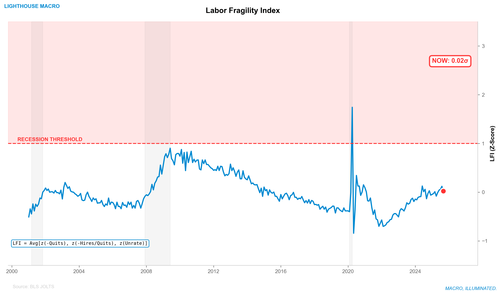

The unemployment rate stands at 4.1%. The Bureau of Labor Statistics reports stable payroll additions. These headline figures suggest soft landing achievement.

**The flow data tells a different story.**

### The Quits Rate Collapse

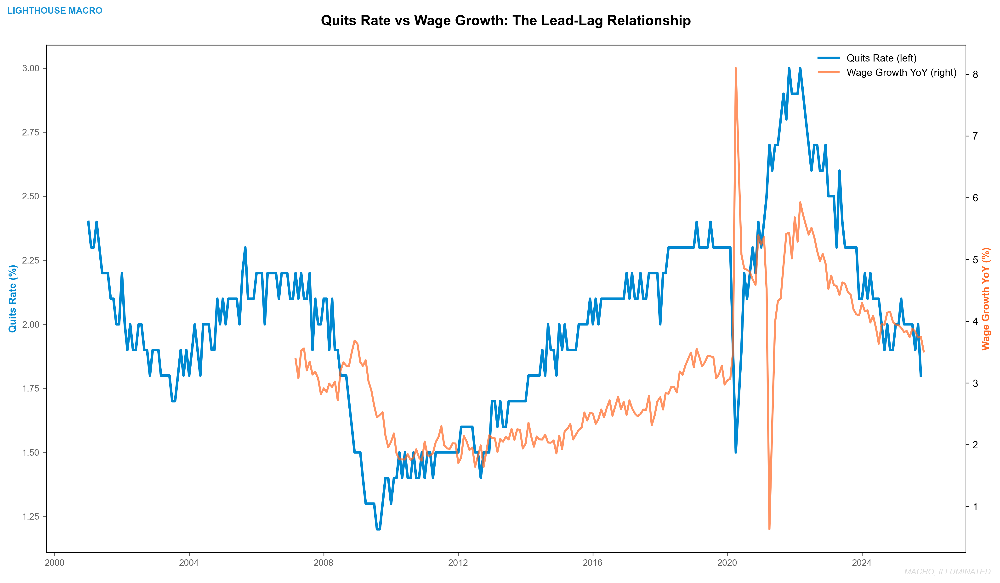

**October 2025 Reading: 1.8%**

This matches the lowest reading since January 2015, excluding the pandemic collapse. For context:
- Peak (April 2022): 3.0% during the "Great Resignation"
- Current: 1.8%
- Decline: 40% from peak—the largest non-recession drop in series history

When workers stop quitting, it signals evaporating confidence in alternative opportunities. They're not being fired—they're hunkering down.

### The Sahm Rule Proximity

Current Sahm Rule reading: **0.35 percentage points**
Recession threshold: **0.50 percentage points**

We are 15 basis points from a signal that has predicted every recession since 1970 without generating a single false positive.

### Duration Analysis: The Hidden Weakness

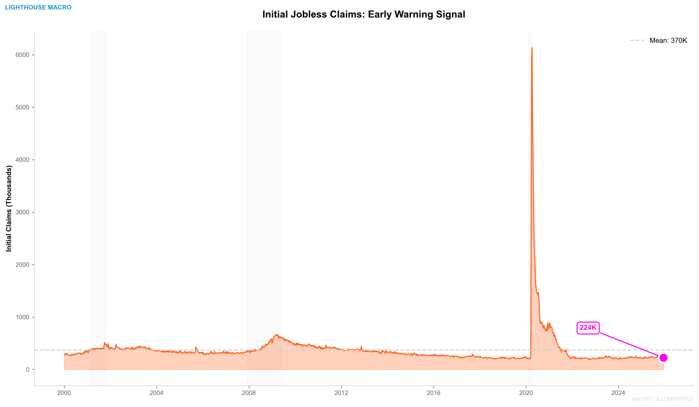

While headline unemployment remains contained:
- Median unemployment duration: **22 weeks** (up from 8 weeks in early 2023)
- Share unemployed 27+ weeks: **24.3%** (approaching late-cycle levels)

Long-duration unemployment has permanent effects. Workers unemployed for 6+ months experience skill depreciation, network atrophy, and employer bias that makes reemployment progressively more difficult.

### The Labor Market Freeze

The labor market is neither robust nor collapsing. It's frozen.

Companies are hoarding labor—layoffs remain historically low—because 2021-2022 hiring difficulties remain fresh in corporate memory. But they're not adding headcount either.

**The critical observation:** When the hiring freeze breaks, it typically transitions to mass layoffs abruptly rather than gradually. Historical precedent: late 1989, late 2000, late 2007 all exhibited similar patterns that lasted 4-8 quarters before breaking.

---

## 1.2 Consumer Credit: The Stress Beneath

### Excess Savings Depletion

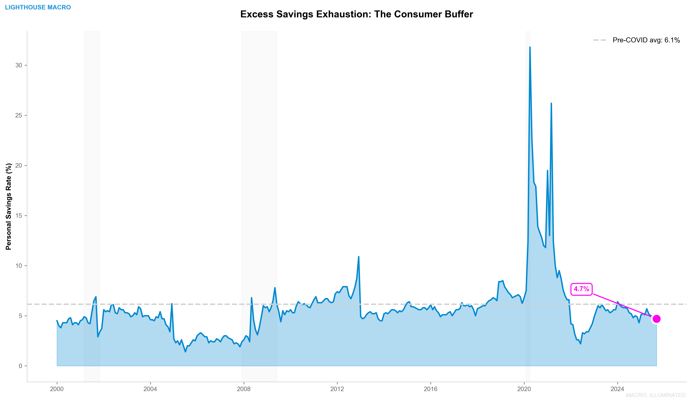

The pandemic-era "excess savings" buffer—estimated at $2.1 trillion at peak in 2021—has been fully depleted for the bottom 80% of households since Q1 2023.

### Credit Card Bifurcation

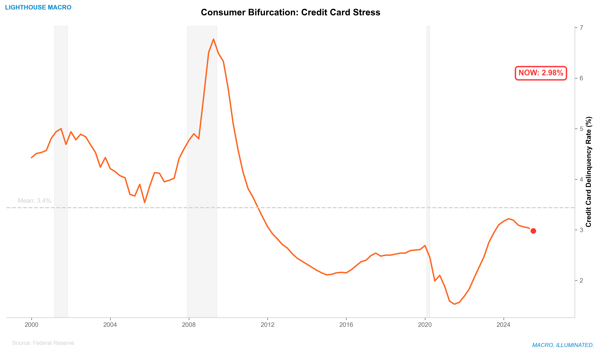

- Credit card balances: **$1.23 trillion** (+5.7% YoY)
- Credit card delinquencies (90+ days): **7.05%**—highest since 2011
- Personal savings rate: **4.4%**—half the historical average

The geographical and income distribution of credit stress reveals concentration in lower-income cohorts: ZIP codes in the bottom income quartile show 90+ day delinquency rates of 10.2% vs. 4.1% in top quartile areas.

### Auto Subprime Stress

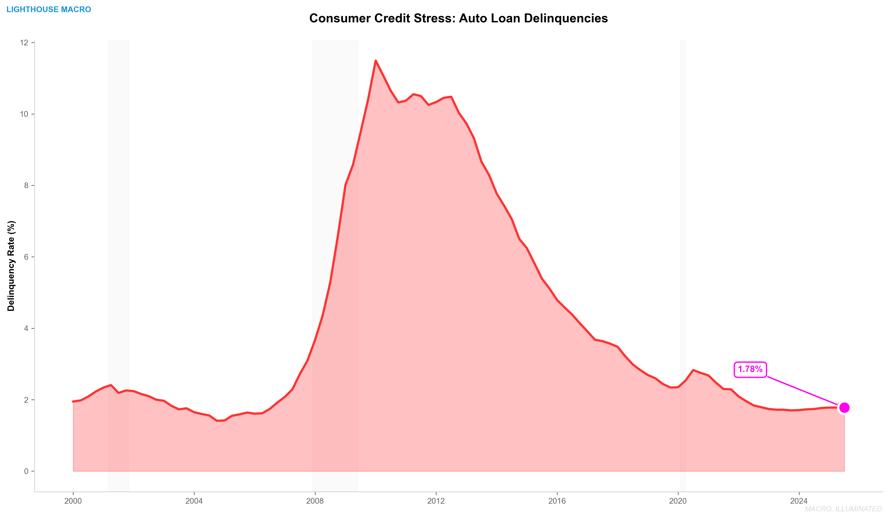

Auto loan delinquencies: **7.3%** and rising.

---

## 1.3 Wealth Concentration

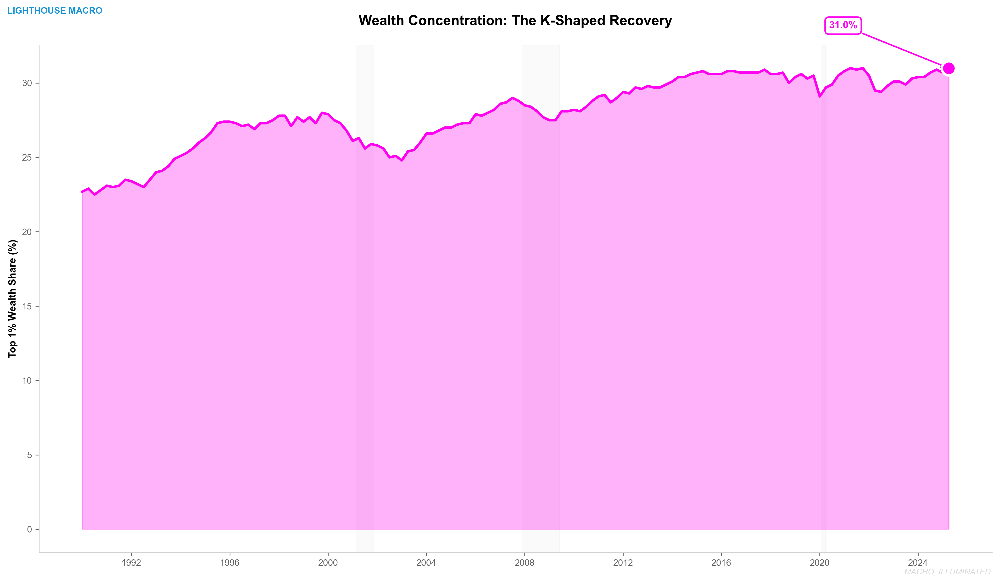

The top 10% of households now control 87% of equity market wealth. This concentration means consumption is increasingly dependent on asset prices rather than wage income.

---

# II. MONETARY MECHANICS: PLUMBING ARCHITECTURE

## 2.1 The RRP Exhaustion

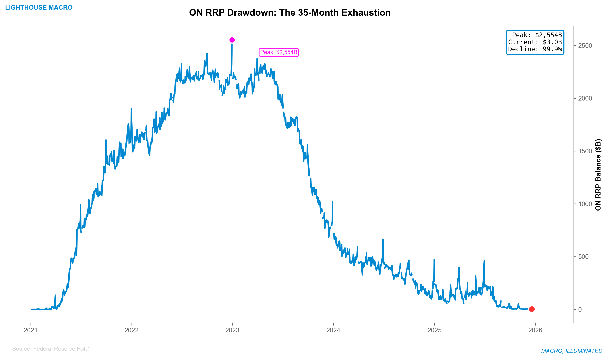

**The Buffer Is Gone**

| Metric | Value |
|--------|-------|
| Peak (Dec 2022) | $2,556 billion |
| Current | $10.75 billion |
| Drawdown | 99.6% |
| Duration | 35 months |

With RRP at operational floor, the system has lost its liquidity shock absorber. Every TGA fluctuation, every large auction settlement, every quarter-end reporting date now impacts bank reserves directly.

## 2.2 Liquidity Cushion Index

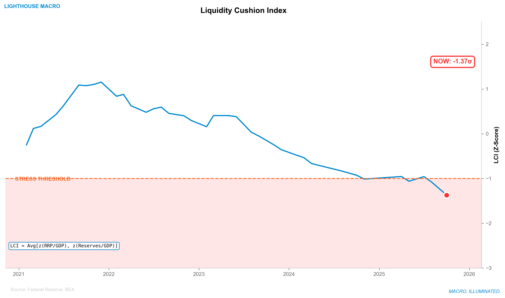

The LCI combines RRP/GDP and Reserves/GDP into a single composite measure of system shock absorption capacity.

**Current LCI: -0.98 (z-score)**

This is the most stressed reading since pre-2020 and indicates minimal buffer against exogenous shocks.

## 2.3 QT Termination and RMP Mechanics


On December 10, 2025, the Fed announced:
- **$40 billion/month** in Treasury bill purchases
- Full reinvestment of MBS principal payments (~$20-25B/month)
- **Total monthly purchases: $60-65 billion**

Over twelve months: **$720-780 billion in balance sheet expansion**—equivalent to 45% of pandemic-era QE monthly pace at peak.

## 2.4 Repo Market Stress Indicators

### SOFR-IORB Dynamics

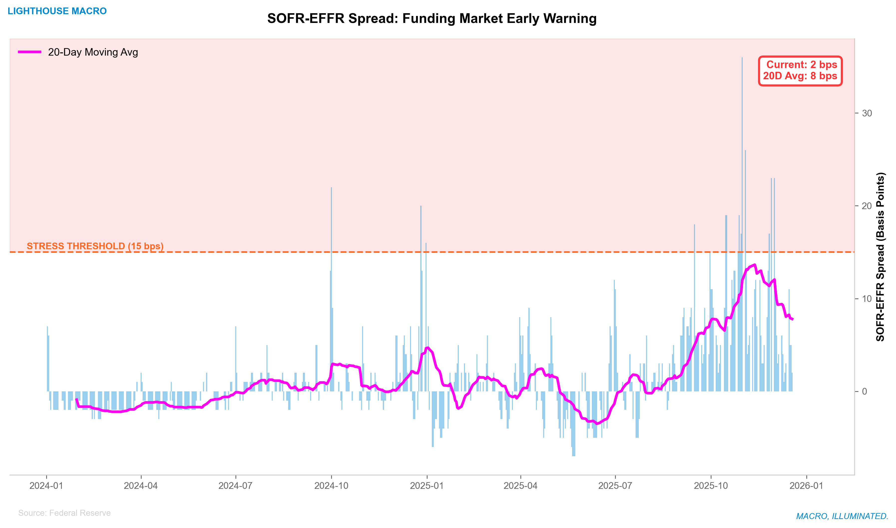

Current SOFR-IORB spread: **+2.0 bps** (should be -3 to -5 bps)

When SOFR trades above IORB, it signals a broken market—participants prefer holding reserves at the Fed rather than lending into the secured repo market.

### Repo Rate Dispersion

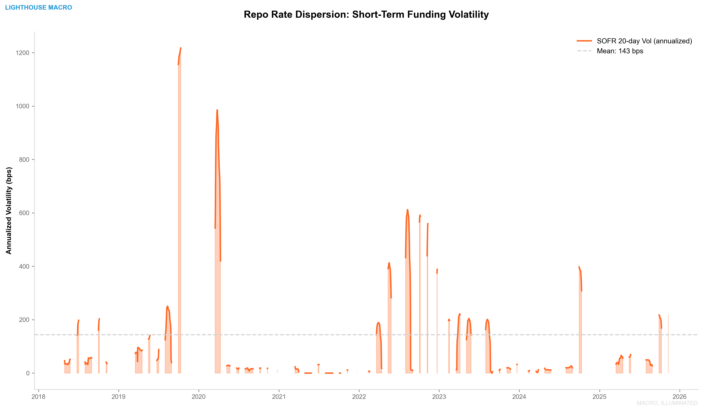

Elevated dispersion in repo rates indicates market stress and dealer balance sheet constraints.

### Reserves as Percentage of GDP

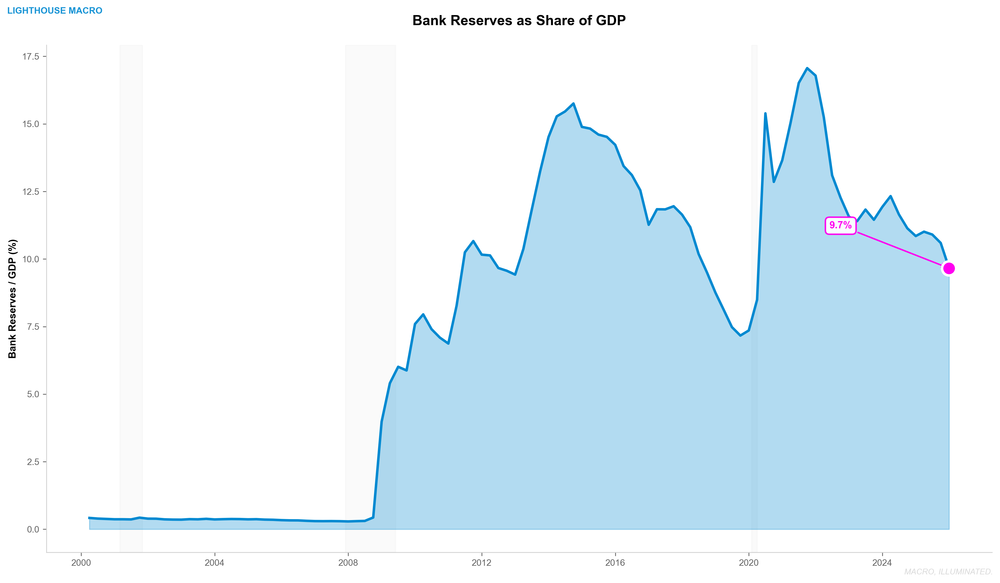

Current: **9.71% of GDP** — down from pandemic peaks but still elevated relative to pre-2008 norms.

---

# III. FISCAL DOMINANCE: THE STRUCTURAL REALITY

## 3.1 Debt Trajectory

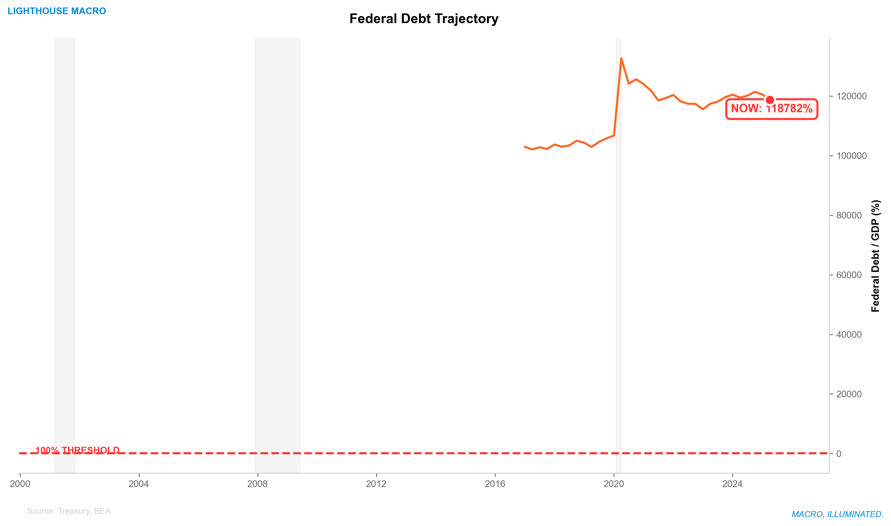

Federal deficit: **$1.78 trillion (6.2% of GDP)**—the fourth-largest peacetime deficit in U.S. history.

Debt-to-GDP: **123.8%** and rising.

## 3.2 Interest Expense Explosion

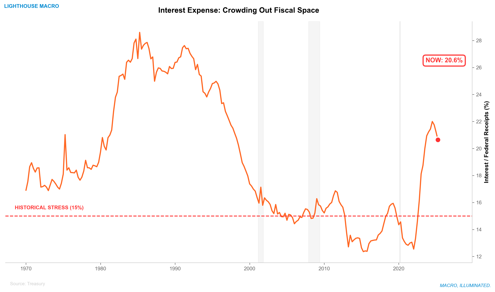

Interest expense: **$1.073 trillion (3.7% of GDP)**—now exceeding defense spending for the first time since 1946.

## 3.3 The Fiscal Dominance Cascade

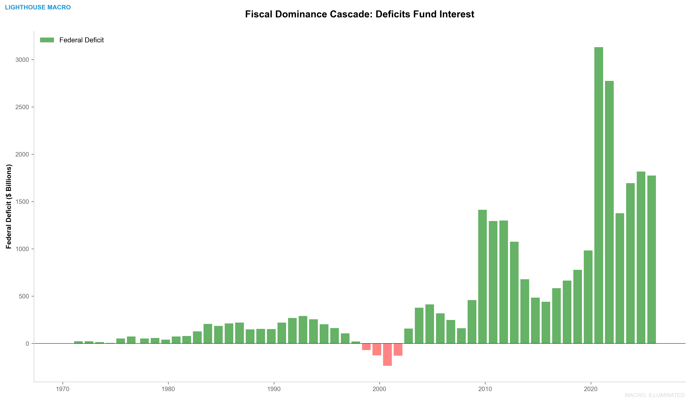

The mechanism: Higher rates → Higher interest expense → Larger deficits → More issuance → More pressure on yields → Repeat.

## 3.4 Foreign Holdings Decline

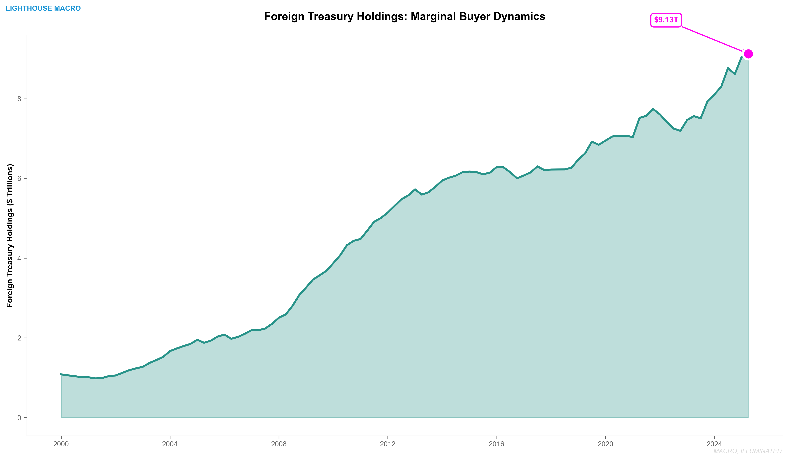

Foreign official holdings have declined from 40% (2015) to 30% (2025). This removes price-insensitive demand exactly when issuance is accelerating.

---

# IV. TREASURY MARKET MECHANICS

## 4.1 Term Premium Repricing

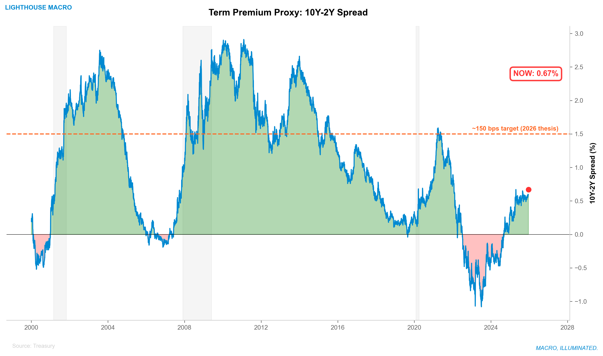

**Model-implied term premium:** 148bps
**Actual term premium:** 74bps
**Gap:** -74 basis points (term premium "too low")

The regression suggests significant mispricing given current fiscal fundamentals.

## 4.2 Dealer Balance Sheet Constraints

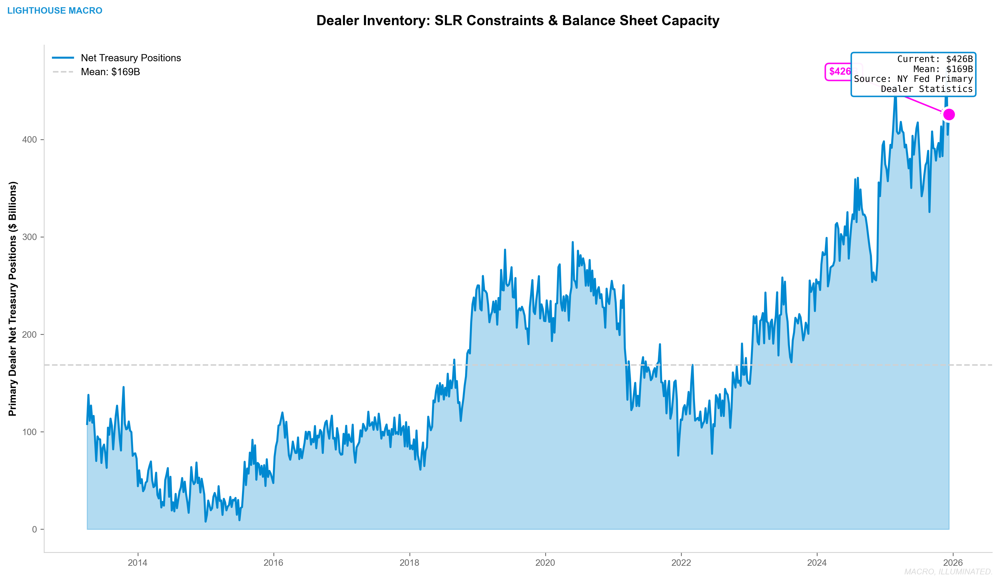

Primary dealers serve as intermediaries between the Treasury and end investors. Basel III's Supplementary Leverage Ratio creates perverse incentives: holding $100M in Treasuries requires the same capital as a $100M corporate loan—despite Treasuries carrying zero credit risk.

### Primary Dealer Takedown

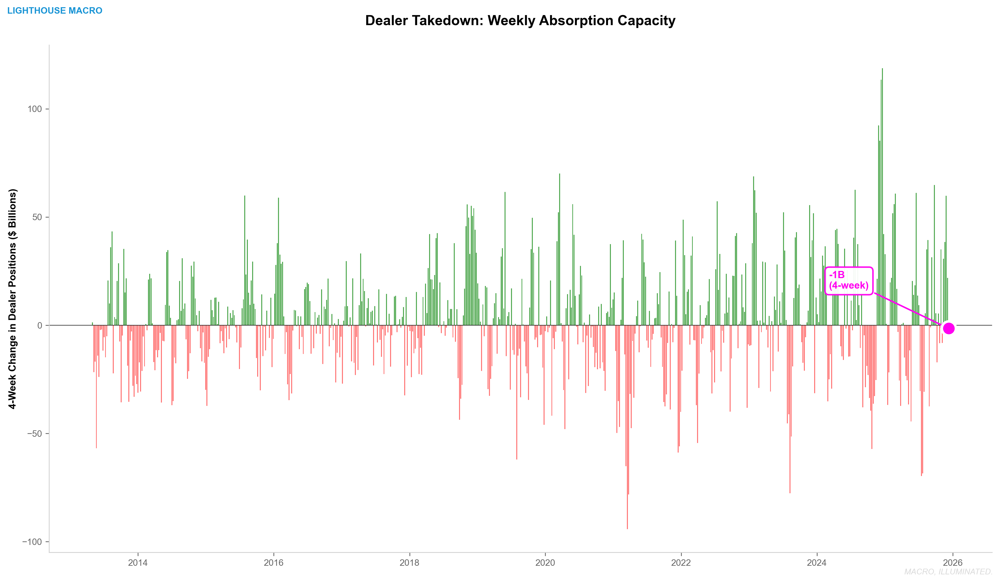

Recent Q4 2025 auctions:
- 10-year note: **24.3%** dealer takedown (vs. 12% average)
- 30-year bond: **28.1%** dealer takedown (vs. 14% average)

Elevated takedown indicates end-investor demand is insufficient at current yields.

### Auction Tails

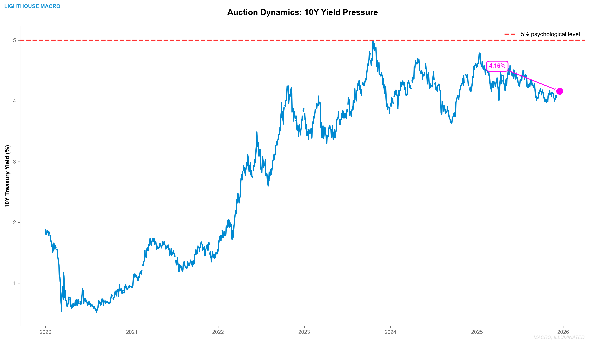

Auction tails (difference between high yield and when-issued) have widened, indicating price uncertainty and dealer reluctance.

## 4.3 Basis Dynamics

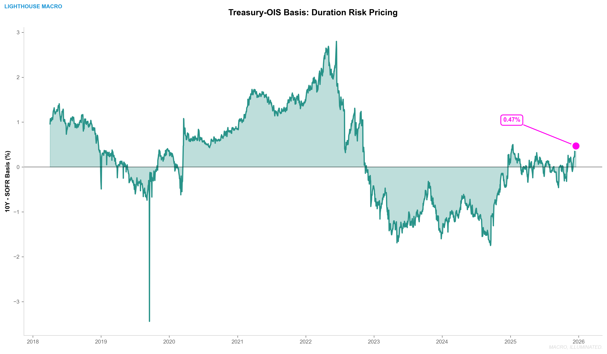

The Treasury basis trade (cash vs. futures) reflects dealer capacity and leverage constraints in the system.

---

# V. CREDIT-LABOR TRANSMISSION

## 5.1 The Credit-Labor Gap

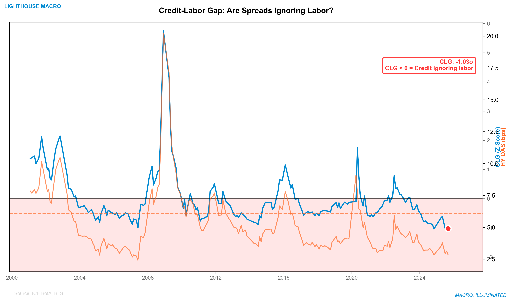

**CLG: -0.45**

The Credit-Labor Gap (CLG) measures z(HY_OAS) - z(LFI). A negative reading indicates credit spreads are tighter than labor market fundamentals would suggest.

**Translation:** HY spreads at 299bps aren't pricing in the labor market weakness visible in flow data.

---

# VI. SCENARIO FRAMEWORK

## Probability-Weighted Outcomes

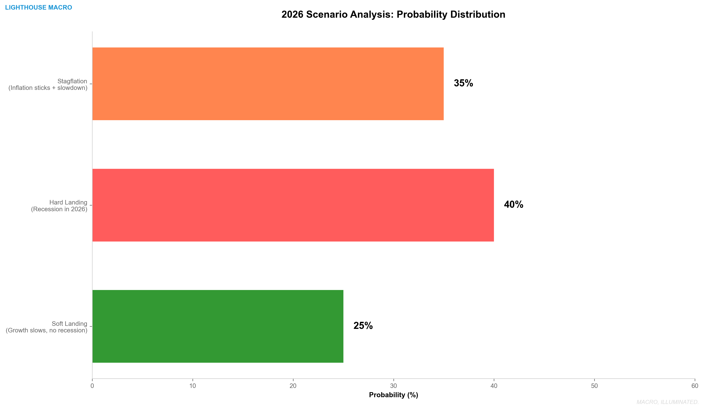

### Scenario A: Reflationary Melt-Up → Mid-Year Repricing
**Probability: 55%**

**Q1 2026:**
- Fed balance sheet expands $60-80B monthly via RMPs
- S&P 500 grinds toward 7,200-7,500
- 10Y yield rises modestly to 4.55-4.70%

**Q2-Q4 2026:**
- Heavy Q2 refunding tests dealer capacity
- **Equities correct 12-18%**
- 10Y yield rises to 4.85-5.00%

---

### Scenario B: Plumbing Accident
**Probability: 30%**

**Triggers:**
- RMPs insufficient to offset dealer constraints
- Major auction fails or massive tail
- Stablecoin run forces T-bill liquidation

**Outcomes:**
- VIX spikes from 19 to 42
- **S&P 500 drops 22-28%**
- HY OAS blows to 720-780bps

**Recovery:** Fed intervention stabilizes within 30-45 days.

---

### Scenario C: Hard Landing
**Probability: 15%**

**Triggers:**
- Labor hoarding breaks: initial claims spike to 320k+
- Consumer spending collapses

**Outcomes:**
- Unemployment rises to 5.2-6.0%
- **S&P 500 declines 28-35%**
- Fed cuts 150bps over 6 months

---

# VII. MONITORING FRAMEWORK

## Critical Calendar

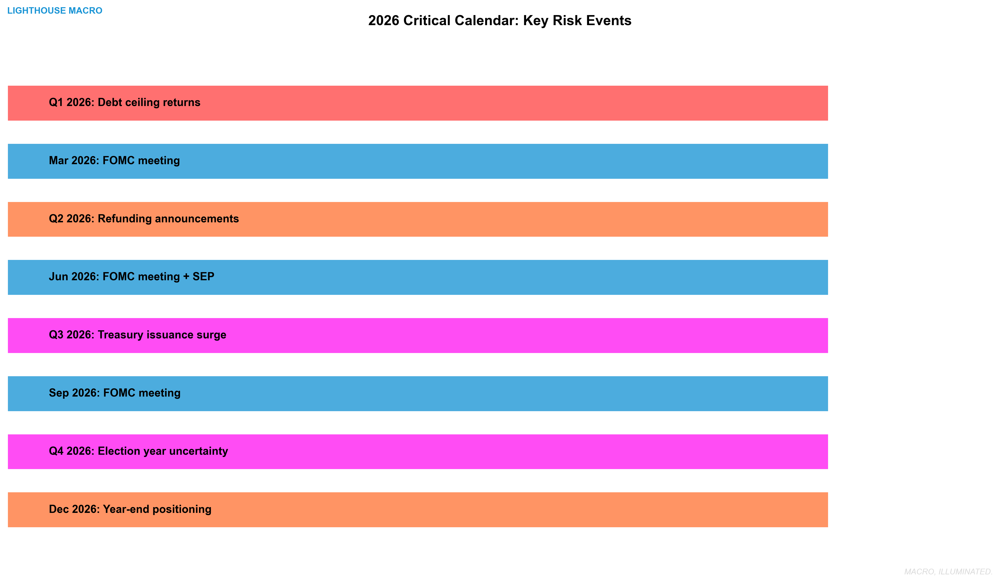

Key dates to watch for plumbing stress: quarter-ends, refunding announcements, FOMC meetings.

## Weekly Indicators

### Plumbing Health
| Indicator | Current | Warning | Crisis |
|-----------|---------|---------|--------|
| RRP Level | $10.75B | <$8B | <$5B |
| SOFR-IORB | +2.0bps | +8bps | +15bps |
| SRF Usage | <$10B | $25B | $60B |

### Labor Market
| Indicator | Current | Warning | Crisis |
|-----------|---------|---------|--------|
| Initial Claims | ~225k | 280k | 320k |
| Sahm Rule | 0.35pp | 0.45pp | 0.55pp |

### Credit Stress
| Indicator | Current | Warning | Crisis |
|-----------|---------|---------|--------|
| HY OAS | 299bps | 550bps | 650bps |
| CC Delinquency | 7.05% | 8.5% | 9.5% |

---

# VIII. POSITIONING IMPLEMENTATION

## Macro Risk Index Dashboard

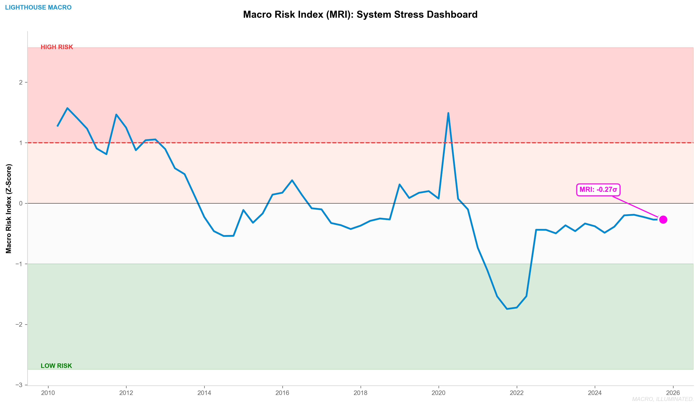

## Positioning Matrix

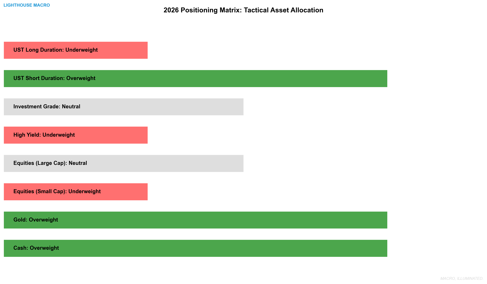

### Q1 2026: Capture the Liquidity

| Asset Class | Allocation | Rationale |
|-------------|------------|-----------|
| **Equities** | 45% | Quality tilt, semiconductors overweight |
| **Cash** | 15% | Dry powder for repricing |
| **Gold** | 5-7% | Fiscal hedge |
| **2Y Treasuries** | 12% | Fed cut optionality |
| **10Y+ Treasuries** | Underweight | Term premium repricing risk |
| **Bitcoin** | 1-2% | Liquidity proxy |

### Q2-Q4 2026: Prepare for Repricing

| Action | Trigger |
|--------|---------|
| Reduce equity to 35-40% | Q1 rally matures, VIX <17 |
| Raise cash to 20% | Breadth deteriorates further |
| Add duration | Recession signals emerge |
| Increase gold to 8-10% | Plumbing stress indicators fire |

### Hedging Strategy

- **VIX Calls:** 3-month tenor, 30-35 strike (plumbing accident protection)
- **Gold:** Benefits in reflationary melt-up AND fiscal stress
- **2Y Treasuries:** Recession hedge with positive carry

---

# IX. CONCLUSION

The liquidity twilight zone refers to the transition period between abundant liquidity (2021-2023) and scarce liquidity (2024-2026). The RRP exhaustion marks the end of effortless accommodation. The system now operates with minimal buffers.

**The trade isn't "be bullish" or "be bearish."**

The trade is: **be tactical in Q1, be defensive by Q2, be liquid throughout.**

Position for the base case. Hedge the tails. Monitor the plumbing.

The Fed reinforced the dam in December. The water level is still rising. Swim while you can, but know where the exits are.

---

**LIGHTHOUSE MACRO**
*MACRO, ILLUMINATED.*

---

**That's our view from the Watch. Until next time, we'll be sure to keep the light on....**

— Bob Sheehan, CFA, CMT

---

*Proprietary Indicators (LFI, LCI, MRI, CLG) powered by lighthouse_engine_fred.py*
*Data sourced from Federal Reserve Economic Data (FRED)*
*Charts generated via OKComputer/Kimi deployment pipeline*
*Last updated: December 19, 2025*

---

## APPENDIX: CHART INDEX

| # | Chart | Section |
|---|-------|---------|
| 01 | RRP Drawdown | Monetary Mechanics |
| 02 | Liquidity Cushion Index | Monetary Mechanics |
| 03 | QT Termination | Monetary Mechanics |
| 04 | SOFR-EFFR Spread | Monetary Mechanics |
| 05 | Repo Rate Dispersion | Monetary Mechanics |
| 06 | Reserves/GDP | Monetary Mechanics |
| 07 | Debt Trajectory | Fiscal Dominance |
| 08 | Interest Expense | Fiscal Dominance |
| 09 | Fiscal Dominance Cascade | Fiscal Dominance |
| 10 | Foreign Holdings | Fiscal Dominance |
| 11 | Term Premium | Treasury Mechanics |
| 12 | Dealer Inventory & SLR | Treasury Mechanics |
| 13 | Dealer Takedown | Treasury Mechanics |
| 14 | Auction Tails | Treasury Mechanics |
| 15 | Basis Dynamics | Treasury Mechanics |
| 16 | Labor Fragility Index | Labor Markets |
| 17 | Job Cuts & Claims | Labor Markets |
| 18 | Quits-Wage Lead | Labor Markets |
| 19 | Excess Savings | Consumer Credit |
| 20 | Subprime Auto | Consumer Credit |
| 21 | Credit Card Bifurcation | Consumer Credit |
| 22 | Wealth Concentration | Consumer Credit |
| 23 | Credit-Labor Gap | Transmission |
| 24 | Critical Calendar | Monitoring |
| 25 | MRI Dashboard | Positioning |
| 26 | Positioning Matrix | Positioning |
| 27 | Scenario Analysis | Scenarios |
